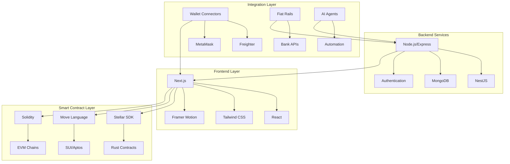

<div align="center">

# PayZoll 💸

### The Future of Web3 Payment Infrastructure

*Bridging TradFi and DeFi with seamless, secure, and scalable payment solutions*

[](https://www.payzoll.xyz/)
[](https://x.com/PayZoll)
[](https://stellar.org)
[](https://github.com/PayZoll-Orgs)

[🚀 Get Started](#quick-start) • [📖 Documentation](#documentation) • [🤝 Community](#community) • [💼 Contact](#contact)

</div>

---

## 🌟 About PayZoll

**PayZoll** is a universal Web3 payment infrastructure revolutionizing how businesses and individuals handle payments across blockchain networks. We're building the bridge between traditional finance (TradFi) and decentralized finance (DeFi), making crypto payments as simple as a button click.

### 🎯 Our Mission

To create an all-in-one financial umbrella that seamlessly blends decentralized and centralized payment rails into a single, turnkey ecosystem—empowering businesses and individuals with secure, scalable, and future-proof financial services.

---

## ✨ Core Features

<table>
<tr>
<td width="50%">

### 💼 Bulk Payroll System
- **Smart Contract-Based**: Automated, trustless payroll processing
- **Multi-Token Support**: Pay in any Stellar asset
- **Gas Abstraction**: No complex wallet management needed
- **Real-Time Processing**: Sub-second transaction finality

</td>
<td width="50%">

### 🔄 Streaming Payments
- **Real-Time Flows**: Continuous payment streams
- **Flexible Scheduling**: Hourly, daily, or custom intervals
- **Instant Settlement**: No waiting for batch processing
- **DAO-Ready**: Perfect for distributed teams

</td>
</tr>
<tr>
<td width="50%">

### 🤝 Recoverable P2P Transfers
- **Dispute Resolution**: Built-in recovery mechanisms
- **Time-Locked Escrow**: Secure fund holding
- **Trust-Minimized**: Cryptographic security guarantees
- **Multi-Signature Support**: Enhanced security options

</td>
<td width="50%">

### 📄 Invoice & Bill Payments
- **Pay with Crypto**: Use tokens for everyday bills
- **Bill Splitting**: Share costs with friends seamlessly
- **Subscription Management**: Recurring payment automation
- **Cryptographic Proof**: Verifiable payment records

</td>
</tr>
<tr>
<td width="50%">

### 💱 Fiat On/Off-Ramps
- **Bank Integration**: Direct fiat-to-crypto conversion
- **One-Click Experience**: Seamless user experience
- **Institutional Liquidity**: Competitive exchange rates
- **Compliance Built-In**: KYC/AML ready

</td>
<td width="50%">

### 🤖 AI-Powered Automation
- **Smart Agents**: Automated recurring payments
- **Compliance Checks**: AI-driven regulatory monitoring
- **Predictive Analytics**: Financial insights and trends
- **Workflow Optimization**: Eliminate manual processes

</td>
</tr>
</table>

---

## 🌐 Multi-Chain Ecosystem

PayZoll is expanding across multiple blockchain networks, each leveraging unique strengths:

### 🌟 Stellar Network (Live on Mainnet)
- **Primary Platform**: Production-ready with real user transactions
- **Bulk Transfers**: Efficient multi-recipient payments
- **Multi-Hop Swaps**: Optimal token conversion paths
- **Low Fees**: Cost-effective for high-volume operations
- **🔗 [Live Website](https://payzoll-stellar.onrender.com/)**

### 🔷 SUI Network
- **Move Language**: Advanced smart contract safety
- **Object-Centric Model**: Perfect for financial assets
- **Parallel Execution**: High throughput payment processing
- **Sub-Second Finality**: Instant transaction confirmation
- **🔗 [Live Website](https://payzoll-sui.pages.dev)**

### 🟦 BASE Network
- **EVM Compatible**: Leveraging Ethereum ecosystem
- **Layer 2 Scaling**: Reduced transaction costs
- **Universal Payment Infrastructure**: TradFi meets Web3

### 🌸 Kaia Network
- **LINE Integration**: Access to millions of users
- **Social Payments**: Messaging-integrated transactions
- **Mass Adoption Focus**: Web2 to Web3 bridge

---

## 🎬 See PayZoll in Action

<div align="center">

[](https://www.youtube.com/watch?v=UHmH9QBLCdo)

*Click to watch our comprehensive demo video*

</div>

---

## 🏆 Recognition & Achievements

- ✅ **Live on Stellar Mainnet** - Production-ready payment infrastructure
- 🏅 **Stellar Community Fund Grant** - [View Submission](https://communityfund.stellar.org/dashboard/submissions/rec9NAmWoC4nMcQnC)
- 🎯 **Multi-Chain Deployment** - Active on 4+ blockchain networks
- 🌍 **Global Reach** - Processing real payments for distributed teams
- 🚀 **Hackathon Success** - Multiple blockchain hackathon awards

---

## 🛠️ Technology Stack



---

## 👥 Team

Our team combines deep expertise in blockchain development, full-stack engineering, and business development:

### **Abhinav Pangaria** - Co-Founder & Lead Engineer
- 🎓 B.Tech CSE from IIIT Guwahati
- 💻 Full-Stack Developer (MERN/Next.js/NestJS)
- ⛓️ Blockchain Developer (Solidity, Move, Rust)
- 🔐 Contract Security & Auditing Expert
- 🏢 Former SDE Intern @ JP Morgan
- 📧 [abhinavpangaria2003@gmail.com](mailto:abhinavpangaria2003@gmail.com)
- 🔗 [LinkedIn](https://www.linkedin.com/in/abhinavpangaria) • [Twitter](https://x.com/18_r_y_u_k_07)

### **Vaibhav** - Founder
- 🎓 B.Tech CSE from IIIT Guwahati
- 💼 Proven Entrepreneurial Leader
- 📈 Led 100+ team achieving 6-figure monthly sales
- 🌏 Managed North-East India e-commerce operations
- 🎯 Strategic Partnerships & Business Development

### **Sarthak Bansal** - Founding Engineer
- 🎓 B.Tech CSE from IIIT Guwahati
- 🔧 Lead Backend Engineer
- ⛓️ Web3 Developer (Solidity, Node.js, MERN)
- 🔐 Security & Auditing Specialist
- 🤝 P2P Protocol Development

---

## 📊 Revenue Model

PayZoll employs a sustainable, multi-stream revenue model:

1. **💰 Maintenance Fees** - Fixed monthly fee per employee
2. **📈 Streaming Fees** - Small percentage on real-time payments
3. **💱 Exchange Fees** - Revenue from token swaps and conversions
4. **🏦 Premium Features** - Advanced analytics and compliance tools
5. **🔄 Off-Ramp Services** - Fees on fiat conversion transactions

---

## 🗺️ Roadmap

### ✅ Q1 2025 - Completed
- ✓ Core payroll smart contracts deployed
- ✓ Stellar Mainnet launch
- ✓ Multi-hop swap mechanism
- ✓ Enhanced frontend experience
- ✓ Partial off-ramp integration

### 🚀 Q2 2025 - In Progress
- ⚙️ Full streaming payments implementation
- ⚙️ Complete off-ramp fulfillment
- ⚙️ AI agents v2 deployment
- ⚙️ zkKYC & anonymous authentication
- ⚙️ Advanced analytics dashboard

### 🔮 Q3 2025 - Planned
- 📋 DAO-based payroll governance
- 🌐 Multi-chain treasury management
- 📊 Web3-enabled accounting system
- 🌍 Global compliance framework
- 🤝 Strategic DEX partnerships

---

## 📚 Documentation

### Quick Start

Choose your blockchain and get started:

<details>
<summary><b>🌟 Stellar Integration</b></summary>

```bash
# Clone the repository
git clone https://github.com/PayZoll-Orgs/PayZoll-1.0.0-P2

# Install dependencies
cd PayZoll-1.0.0-P2
npm install

# Setup frontend
cd Frontend
npm install

# Run development server
npm run dev
```

**Required Tokens:**
- Native: `CDLZFC3SYJYDZT7K67VZ75HPJVIEUVNIXF47ZG2FB2RMQQVU2HHGCYSC`
- USDC: `CBIELTK6YBZJU5UP2WWQEUCYKLPU6AUNZ2BQ4WWFEIE3USCIHMXQDAMA`

**Contract Address:** `CAAX52OHYPSYCUFTEO4FHQL345SYQD6D7JAGSPOFNMXXQJXO6DAHN3QR`

</details>

<details>
<summary><b>🔷 SUI Integration</b></summary>

**Mainnet Contracts:**
- Secure Transfer: `0xe48836adecb638703f5444b2d26fefb729c967c9455334867c3f25a6edc7e610`
- Bulk Payroll: `0x777cae1b97c072eae268f19012120b979a28430ea12020bd294571cf94303593`

**Testnet Contracts:**
- Secure Transfer: `0x5a9a6c0db570d796c0369cefc05a184fcd24541afa8986e392e6890a3472832d`
- Bulk Payroll: `0xfbd9c32958b04d778001a21c2b512b8688e635120f03b22cf3ff6bada43f477c`

</details>

### 🔗 Repository Links

| Repository | Description | Language | Status |
|------------|-------------|----------|--------|
| [PayZoll-1.0.0-P2](https://github.com/PayZoll-Orgs/PayZoll-1.0.0-P2) | Stellar Implementation | JavaScript/Rust | 🟢 Production |
| [PayZoll_SUI](https://github.com/PayZoll-Orgs/PayZoll_SUI) | SUI Network Implementation | TypeScript/Move | 🟢 Production |
| [PayZoll_BASE](https://github.com/PayZoll-Orgs/PayZoll_BASE) | BASE Network Implementation | TypeScript/Solidity | 🟡 Development |
| [Kaia-Client](https://github.com/PayZoll-Orgs/Kaia-Client) | Kaia Network Client | JavaScript | 🟡 Development |

---

## 🤝 Community

Join our growing community and stay updated:

<div align="center">

[](https://x.com/PayZoll)
[](https://github.com/PayZoll-Orgs)

</div>

### 🌐 Links
- **Website:** [payzoll.xyz](https://www.payzoll.xyz/)
- **Twitter/X:** [@PayZoll](https://x.com/PayZoll)
- **GitHub:** [PayZoll-Orgs](https://github.com/PayZoll-Orgs)
- **Stellar Demo:** [payzoll-stellar.onrender.com](https://payzoll-stellar.onrender.com/)
- **SUI Demo:** [payzoll-sui.pages.dev](https://payzoll-sui.pages.dev)
- **YouTube:** [Watch Demo](https://www.youtube.com/watch?v=UHmH9QBLCdo)

### 🎯 Featured By
- **Stellar Community Fund** - Officially supported
- **BNB Chain** - Ecosystem partner
- **ETHIndia** - Hackathon participant
- **Multiple Blockchain Ecosystems** - Multi-chain presence

---

## 🤝 Contributing

We welcome contributions from developers, designers, and blockchain enthusiasts! Here's how you can help:

1. **Fork the Repository** - Choose the chain you want to work on
2. **Create a Feature Branch** - `git checkout -b feature/amazing-feature`
3. **Commit Your Changes** - `git commit -m 'Add amazing feature'`
4. **Push to Branch** - `git push origin feature/amazing-feature`
5. **Open a Pull Request** - Describe your changes

### 🎨 Areas We Need Help With
- 🔧 Smart contract development
- 🎨 UI/UX improvements
- 📝 Documentation
- 🐛 Bug reports and fixes
- 🌍 Internationalization
- 🧪 Testing and QA

---

## 📜 License

This project is licensed under the **MIT License** - see individual repository LICENSE files for details.

---

## 💼 Contact

### For Business Inquiries & Partnerships
📧 **General:** [tech@payzoll.in](mailto:tech@payzoll.in)

### For Technical Support
📧 **Abhinav Pangaria:** [abhinavpangaria2003@gmail.com](mailto:abhinavpangaria2003@gmail.com)

### For Bug Reports
🐛 Use the issue tracker in the relevant repository

---

<div align="center">

## 🌟 Why PayZoll?

| Feature | Traditional Payroll | PayZoll |
|---------|---------------------|---------|
| **Processing Time** | 3-5 business days | Instant (sub-second) |
| **Cross-Border Fees** | 3-7% + FX markup | <1% + minimal gas |
| **Token Support** | Fiat only | Any Stellar/SUI asset |
| **Automation** | Manual processes | AI-powered agents |
| **Transparency** | Opaque | Blockchain-verified |
| **Recovery Options** | Complex disputes | Built-in mechanisms |

---

### 🚀 Join the Web3 Payment Revolution

**PayZoll is more than a payment platform—it's a movement towards financial inclusion, transparency, and efficiency in the global economy.**

[](https://github.com/PayZoll-Orgs) ⭐ 
**Star us to show your support!**

---

*Empowering global payments with the power of decentralized technology*

**Built with ❤️ by the PayZoll Team**

</div>
